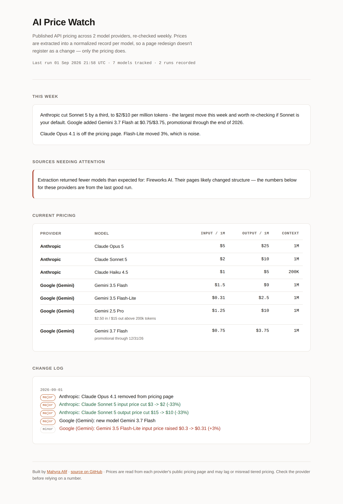

# AI Price Watch

Tracks published API pricing across 7 AI model providers (111 models), detects what changed,
and publishes a weekly digest to a public page.

**→ [Live site](https://mahyraa.github.io/ai-price-watch/)**



## Why

Model prices move constantly and the changes are hard to follow — providers
rarely announce a price cut, they just edit the page. If you're building on these
APIs, a 30% change in your largest cost line can ship without you noticing.

This watches the pricing pages so you don't have to, and it runs itself.

## How it works

```
fetch → extract → diff → summarize → publish
```

1. **Fetch** each provider's public pricing page and reduce it to visible text.
2. **Extract** a normalized record per model — name, input price per million
   tokens, output price, context window — using an LLM with a constrained
   output schema.
3. **Diff** the new records against the last snapshot to find added models,
   removed models, price moves, and context-window changes. Each change is
   classified major or minor.
4. **Summarize** the run into a short digest.
5. **Publish** a static page with current pricing and the full change log.

Runs every Monday via GitHub Actions. Each run commits its snapshots back to the
repo, so the repository itself accumulates a public time series of AI pricing.

## The main design decision

The obvious way to build a change watcher is to hash the page HTML and alert when
the hash moves. That doesn't work. Pricing pages are rebuilt constantly, so a
rotated CSS hash or a reordered nav produces a "change" on almost every run, and
none of them are about pricing. The signal-to-noise ratio is close to zero.

So this extracts structured data first and diffs *that*. A provider can redesign
their entire page and this correctly reports nothing, because the prices didn't
change. Conversely, a price buried in a redesign still gets caught.

The cost is that extraction can fail quietly, which leads to the second decision.

## Failing loudly

The worst outcome for a watcher isn't crashing — it's a scraper that silently
starts returning nothing and reports "no changes" forever while you trust it.

Every source declares `expect_min`, the minimum number of models it should
produce. A run that comes back under that threshold is marked **broken** rather
than empty: the old snapshot is preserved, the provider is flagged on the site,
and nothing is reported as removed. A dead source is visible instead of silent.

## Running it

```bash
git clone https://github.com/mahyraa/ai-price-watch
cd ai-price-watch
pip install -r requirements.txt

cp .env.example .env        # add your Anthropic API key
export $(cat .env | xargs)

python -m src.run           # all sources
python -m src.run --only anthropic   # one source, for debugging
python -m pytest tests/ -q  # the diff engine's tests
```

Output lands in `docs/index.html` (served by GitHub Pages), snapshots in `data/snapshots/`.

Cost is roughly $0.02 per run — seven cheap extraction calls and one digest.

## Adding a provider

Add a block to `config/sources.yaml`. No code changes needed.

```yaml
  - key: newprovider
    name: New Provider
    url: https://newprovider.com/pricing
    expect_min: 3
```

## Layout

```
config/sources.yaml   providers, models, thresholds
src/fetch.py          HTTP + text extraction
src/extract.py        LLM → structured pricing records
src/diff.py           snapshot comparison and change classification
src/summarize.py      changes → weekly digest
src/render.py         static site generation
src/run.py            orchestration
tests/test_diff.py    14 tests on the comparison logic
data/snapshots/       one JSON file per provider, committed each run
```

Tests cover `diff.py` because that's where the real logic lives — everything else
is plumbing around it. The cases that matter are the ones that shouldn't fire: a
cosmetic rename, a sub-threshold price move, a page that returns nothing.

## Limitations

- Tiered pricing (different rates above a context threshold) is captured in a
  free-text `notes` field rather than modeled properly. Fine for reading, not for
  computing a bill.
- Batch, cache, and fine-tuning prices aren't tracked — inference only.
- Extraction is not perfectly repeatable. The same page can yield a slightly
  different model list between runs, which shows up as a phantom added/removed
  model. The prompt is written to minimise this, but the honest fix is to require
  a change to persist across two consecutive runs before reporting it.
- Providers that render pricing entirely in client-side JavaScript won't extract
  from plain HTTP. xAI, Groq and Fireworks were dropped for this reason — adding
  them back would mean running a headless browser on every check, which is a lot
  of maintenance for three more providers.

## License

MIT.
